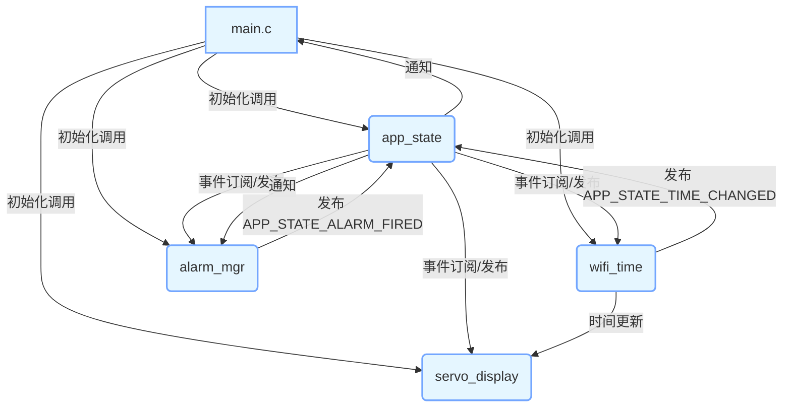

# ESP32-WiFi-Sync Mechanical Segment Clock

一个基于 ESP32-S3（兼容 ESP32）的 Wi-Fi 同步机械段码时钟。  
核心功能：
- 通过 NTP 自动同步时间（支持时区）。
- 舵机驱动 88:88 机械段码显示当前时间。
- 支持最多 10 组闹钟/定时器。
- 模块化 C 语言代码，方便后期扩展语音等子系统。

## 1. 仓库结构

```angular2html
├── .git/                  # Git 版本控制目录
├── .gitignore             # Git 忽略文件配置
├── .idea/                 # IDE 项目配置目录
├── CMakeLists.txt         # ESP-IDF 根构建文件
├── README.md              # 项目说明文档
├── build/                 # 编译构建输出目录
├── cmake-build-debug-esp32/ # CMake 调试构建目录
├── sdkconfig              # 项目配置文件
├── partitions.csv         # 分区表文件（应用 + NVS 足够）
├── main/
│   ├── CMakeLists.txt     # 主模块构建文件
│   ├── alarm_mgr.c        # 闹钟管理模块实现文件
│   ├── alarm_mgr.h        # 闹钟管理模块头文件
│   ├── app_state.c        # 应用状态管理模块实现文件
│   ├── app_state.h        # 应用状态管理模块头文件
│   ├── main.c             # 项目入口文件，包含初始化和主循环
│   ├── servo_display.c    # 舵机显示模块实现文件
│   ├── servo_display.h    # 舵机显示模块头文件
│   ├── wifi_time.c        # Wi-Fi 时间同步模块实现文件
│   └── wifi_time.h        # Wi-Fi 时间同步模块头文件
└── test/                  # Unity 单元测试目录
```


## 2. 运行时架构



## 3. 模块职责
| 模块 | 任务与接口 |
|---------------|---------------------------------------------------------------------------------------------------------------------| 
| wifi_time | 1. 启动 STA 模式，连接到配置的 Wi-Fi SSID 和密码（默认 SSID 为 204小居-书房，密码为 lhcj@1024）。<br>2. 通过 SNTP 获取 UTC 时间，并根据 CST-8 时区设置进行时间转换。<br>3. 提供 wifi_time_init() 初始化函数。 |
| servo_display | 1. 初始化 2 * 16 路 PWM（LEDC）来驱动舵机阵列。<br>2. 提供 servo_display_set(const char *str) 接口，仅支持 "HHMM" 或 "HH:MM" 格式的字符串显示。<br>3. 提供 servo_display_init() 初始化函数，初始化完成后打印日志。 |
| alarm_mgr | 1. 使用 NVS 持久化存储闹钟列表，最多支持 10 组闹钟。<br>2. 提供 alarm_add(uint8_t hour, uint8_t min) 用于添加闹钟。<br>3. 提供 alarm_del(uint8_t idx) 用于删除指定索引的闹钟。<br>4. 提供 alarm_list(size_t *cnt) 用于获取闹钟列表。<br>5. 当系统时间变化时，检查是否有闹钟触发，若触发则发布 APP_STATE_ALARM_FIRED 事件。 | 
| app_state | 1. 管理应用的全局状态，包括当前时间和 Wi-Fi 连接状态。<br>2. 提供 app_state_set_wifi(bool connected) 用于设置 Wi-Fi 连接状态，状态变化时发布相应事件。<br>3. 提供 app_state_is_wifi_connected() 用于获取 Wi-Fi 连接状态。<br>4. 提供 app_state_set_time(uint8_t hour, uint8_t min) 用于设置时间，时间变化时发布 APP_STATE_TIME_CHANGED 事件。<br>5. 提供 app_state_get_time() 用于获取当前时间。 | 
| main.c | 1. 初始化 NVS、事件循环、Wi-Fi 时间同步、舵机显示和应用状态等组件。<br>2. 创建 time_sync_task 任务，每 10 秒更新一次时间显示。<br>3. 订阅 APP_STATE_ALARM_FIRED 事件，事件触发时打印告警信息。<br>4. 进入无限循环，保持程序持续运行。 |
---

## 4. 配置与编译

```bash
idf.py set-target esp32    # 或 esp32
idf.py menuconfig          # 在 Example Configuration 中填写 Wi-Fi SSID/PWD
idf.py flash monitor
```

- Wi-Fi 配置：在 menuconfig 的 Example Configuration 中填写 Wi-Fi SSID 和密码，默认 SSID 为 204小居-书房，密码为 lhcj@1024。
- 时区配置：默认时区为 CST-8，可在 menuconfig 中修改。

## 5. 注意事项

- 供电问题：舵机驱动电流较大，建议为舵机单独供电，避免影响 ESP32 正常工作。
- NVS 存储：闹钟信息存储在 NVS 中，若需要清空闹钟信息，可擦除 NVS 分区。
- 时间同步：设备需要连接到 Wi-Fi 网络才能进行时间同步，若网络连接失败，时间显示可能不准确。

## 6. 事件说明

| 事件名称 | 触发条件 | 
|--------------------------|--------------------------------------------------------------------------| 
| APP_STATE_TIME_CHANGED | 当系统时间发生变化时触发，例如通过 app_state_set_time() 设置时间或时间同步完成。 |
| APP_STATE_ALARM_FIRED | 当设定的闹钟时间到达时触发。 |
| APP_STATE_WIFI_CONNECTED | 当设备成功连接到 Wi-Fi 网络时触发。 |
| APP_STATE_WIFI_DISCONNECTED | 当设备与 Wi-Fi 网络断开连接时触发。 |
